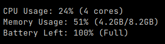

# mintop

An *incredibly* minimal terminal monitoring application written in Go.  It was made because I just wanted a small status indicator that shows me CPU, RAM and Battery usage without distracting graphs and colours.

I've only tested it on Linux (Fedora 34), it *probably* works on macOS and Windows as it uses [distatus/battery](https://github.com/distatus/battery) and [shirou/gopsutil](https://github.com/shirou/gopsutil) but that's not a promise. If you do use it on those systems, please let me know and I'll update this.

## Usage:

You can download a release from [the releases page](https://github.com/joshuathompsonlindley/mintop/releases) and run `./mintop` or download the source and `go mod tidy && go build` to build it yourself.

## Image:

